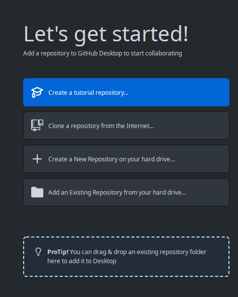
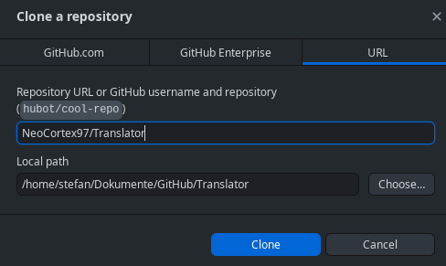

# Translator

Verwandelt die formatierte Eingabe in html code.  
Hinweise zur benutzung gibt es [hier](#benutzung)

## Installation

1. Klone das Rpository, oder lade das Repository als ZIP-Datei herunter
    1. Wenn du das Repository als ZIP heruntergeladen hast, dann musst du sie entpacken, bevor du weitermachen kannst. Ich empfehle dir sie irgendwo unter `Dokumente` zu entpacken.
    2. Wenn du das repository lieber klonen möchtest, musst du dir einen `git`-Client installieren wenn du den noch nicht hast. Der einfachste davon nennt sich [Github-Desktop](https://desktop.github.com/).
    Eine Anleitung dafür findest du [hier](https://docs.github.com/en/desktop/installing-and-configuring-github-desktop/installing-and-authenticating-to-github-desktop/installing-github-desktop)
    3. Wenn du github Desktop verwendest, dann findest du unter [hier](#klonen-mit-gihub-desktop) noch eine ausführliche Anleitung.
2. Installiere [Nodejs](https://nodejs.org/en/).
    1. Es sollte egal sein, ob du die aktuellste stabile Version, oder die LTS Version installierst. Nur ältere und prerelease Versionen solltest du vermeiden.
    2. Wenn du den Installer runtergeladen hast, sollte es genügen ihn zu starten und den Anweisungen im Installer zu folgen. [hier](https://radixweb.com/blog/installing-npm-and-nodejs-on-windows-and-mac) ist allerdings auch dafür noch eine Anleitung.
3. Öffne den Ordner, in dem das Repository liegt.
4. Starte die Datei `install.bat`. Daraufhin öffnet sich ein Fenster mit schwarzem Hintergrund und weißem Text. Hier läuft ein Ladebalken durch. Dieses Script läd alle Bibliotheken herunter, die benötigt werden.
    1. Wenn du MacOS, dann starte anstatt `install.bat` die Datei `install.sh`
    2. Wenn du nach einem Update Probleme hast, oder wenn du als ZIP runtergeladen hast und eine neue Version heruntergeladen hast, musst du diesen schritt nach jedem Update ausführen.
    3. Wenn du das repoitory geklont hast und es gibt nach einem update Probleme, dann wieder hole diesen Schritt ebenfalls.
    4. Sollte es bei diesem Schritt Probleme gehen, dann folge der Anleitung zum [Troubleshooting](#troubleshooting).
5. Um den Server zu starten starte die Datei `start.bat` aus.
    1. Wenn du MacOS benutzt, dann starte bitte anstatt `start.bat` die Datei `start.sh`.

## Troubleshooting

### Dein Fehler passiert beim Installieren

Wenn ín der Fehlermedung etwas von Speicher steht, dann bedeutet das wahrscheinlich, dass du nicht genug Platz auf der Festplatte hast. Die Lösung ist relativ einfach. Mach einfach ein bisschen platz auf der Festplatte, auf der das Repository liegt.

### Dein Fehler passiert beim Starten

Wenn in der Fehlermedung steht, dass der Port 1234 nicht benutzt werden kann, kannst du ihn ignorieren. Das Tool wird automatisch auf einem anderen Port gestertet und du kannst es ganz normal auf dem neuen Port benutzen.

Wenn in der Fehlermedung etwas davon steht, dass beim Bauen ein Fehler aufgetreten ist, dann kannst du die beiden Ordner `.parcel-cache` und `node_modules` löschen und Schritt 4 der Installation erneut ausführen. 

### Dein Fehler ist hier nicht aufgeführt

Öffne ein Issue, oder kontaktiere mich.

## Benutzung

* Du kannst direkt aus einem Dokument kopieren, so lange du es in LibreOffice, oder OpenOffice geöffnet hast. Das Kopieren aus Word funktioniert leider nicht gut, oder garnicht. Bei einfachen Dokumenten könnte allerdings auch Word funktionieren.
* Wenn du möchtest, dass zwischen zwei Zellen eine Leere Zeile ist, dann benutze eine `spacer`-Zelle.

## Klonen mit Gihub desktop

Wenn du Github-Desktop nach der installation zum ersten mal startest, wirst du gefragt, ob du dich mit deinem Github account einloggen möchtest. Wenn du einen Account besitzt, ist das einfachst dich damit einzuloggen.  
Wenn nicht, dann findest du unten im Fenster den Text `Skip this step`, oder `diesen Schritt überspringen`.

Wenn du den Schritt mit dem Einloggen übersprungen hast, dann musst du zuerst noch einen namen und eine Emailaddresse ausfüllen. Die sind vollkommen egal und nur dann interessant, wenn du änderungen am Tool selbst vornehmen möchtest. Trage da also ein, was du willst.

Wenn das alles funktioniert hat, kommst du auf einen Bildschirm, der unter anderem Folgendes zeigt:
  
Hier möchtest du auf den Button drücken, auf dem `Clone a new repository from the Internet` steht.

Daraufhin öffnet sich dieses Fenster:
  
Hier kannst du den Link, zu diesem Repository eintragen, oder du trägst `NeoCortex97/Translator` ein und drückst den `Clone` button.

Daraufhin wird das Tool heruntergeladen und du gelangst in eine Übersicht über das Repository. 

### In einem Dateibrowser öffnen

Wenn du mit dem Tool arbeiten möchtest, dann musst du den Ordner öffnen. Entweder du weißt noch, wohin du es geklont hast, oder du öffnest es in Github-Desktop und findest dort unter `Repository` -> `Show in File Manager`.

### Updates machen

Öffne das Repository in Github-Desktop und Aktualisiere das Repository unter `Repository` -> `Pull`.